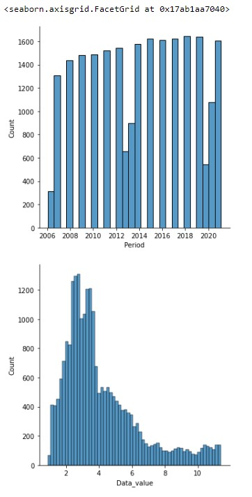

# Ex-04-EDA
# AIM:
To perform EDA on the given data set.
# EXPLANATION:
The primary aim with exploratory analysis is to examine the data for distribution, outliers and anomalies to direct specific testing of your hypothesis.
# ALGORITHM:
# STEP 1:
Import the required packages(pandas,numpy,seaborn).
# STEP 2:
Read the given .csv file.
# STEP 3:
Convert the file into a dataframe and get information of the data.
# STEP 4:
Remove the non numerical data columns using drop() method.
# STEP 5:
Replace the null values using (.fillna).
# STEP 6:
Returns object containing counts of unique values using (value_counts()).
# STEP 7:
Plot the counts in the form of Histogram or Bar Graph.
# STEP 8:
Find the pairwise correlation of all columns in the dataframe(.corr()).
# STEP 9:
Save the final data set into the file.

# CODE:
~~~
PROGRAM DEVELOPED BY: R.SOMEASVAR.
REGISTER NUMBER: 212221230103.
~~~
```
import pandas as pd
import numpy as np
import seaborn as sns
df=pd.read_csv("food-price-index-2021.csv")
df
df.info()
df.isnull().sum()
df["Data_value"]=df["Data_value"].fillna(df["Data_value"].median())
df.isnull().sum()
df.boxplot()
Q1 = df.quantile(0.25)
Q3 = df.quantile(0.75)
IQR = Q3 - Q1
print(IQR)
df_out = df[~((df < (Q1 - 1.5 * IQR)) |(df > (Q3 + 1.5 * IQR))).any(axis=1)]
print(df_out.shape)
df_out.boxplot()
df_out.info()
df["Series_reference"].value_counts()
df_out["Series_reference"].value_counts()
df["Period"].value_counts()
df_out["Period"].value_counts()
df["Data_value"].value_counts()
df_out["Data_value"].value_counts()
df["Series_title_1"].value_counts()
df_out["Series_title_1"].value_counts()
df_out
df_out.corr()
sns.heatmap(df_out.corr(),annot=True)
df.corr()
sns.heatmap(df.corr(),annot=True)
sns.countplot(x="Data_value",data=df_out)
sns.countplot(x="Period",data=df_out)
sns.displot(df_out["Period"])
sns.displot(df_out["Data_value"])
pd.crosstab(df_out["Data_value"],df_out["Series_title_1"])
pd.crosstab(df_out["Period"],df_out["Series_title_1"])

```

# OUTPUT:
# INITIAL DATA FRAME:

# NUMBER OF ROWS AND COLUMNS IN THE DATA FRAME:

# SUM OF NULL DATA VALUE PRESENT IN EACH COLUMN:

# GRAPHICAL REPRESENTATION - BEFORE REMOVING OUTLIERS:

# STATISTICAL METHOD(IQR) TO REMOVE OUTLIERS FROM DATASET:

# GRAPHICAL REPRESENTATIOM - AFTER REMOVING OUTLIERS:


# INFORMATION ON NUMBER OF ROWS AND COLUMNS AFTER REMOVING:


# INSIGHT ABOUT DATA IN COLUMN - SERIES_REFERNECE:

# INSIGHT ABOUT DATA IN COLUMN - PERIOD:


# INSIGHT ABOUT DATA IN COLUMN - DATA_VALUE:


# INSIGHT ABOUT DATA IN COLUMN - SERIES_TITLE_1:


# DATASET AFTER REMOVING OUTLIERS:

# CORRELATION OF COLUMNS:


# ANALYZATION OF COLUMN - DATA_VALUE:

# NON CATEGORICAL DATA - DISTIBUTIVE PLOT::


# CROSS TAB OF PERIOD AND SERIES_TITLE_1:


# RESULT:
Thus the Exploratory Data Analysis (EDA) on the given data set is successfully completed.
